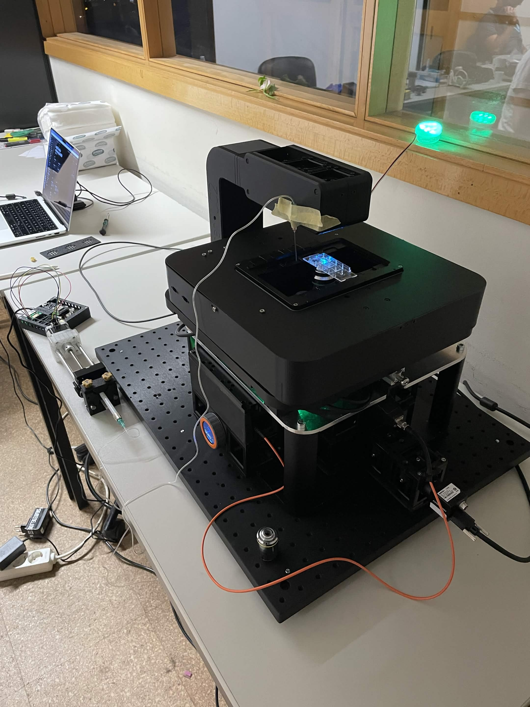

# Lissabon

An automated fluorescence microscopy controller for bacteria viability assays, built on the [Arkitekt Next](https://arkitekt.live) framework and the [UC2Frame](https://openuc2.com/frame-2/).

<p align="center">

</p>

## Overview

Lissabon orchestrates a fully automated live/dead staining protocol using SYTO9 and Propidium Iodide (PI) dyes. It coordinates three hardware services:

| Service | Role |
|---|---|
| **ImSwitch** (`imswitchlissabon`) | Fluorescence microscope — stage movement, laser control, image acquisition |
| **ESP32** (`test-esp32`) | Stepper motor pump — liquid aspiration and dispensing |
| **StarMist** (`starmist`) | Cell segmentation — StarDist-based image analysis |

## Requirements

- Python ≥ 3.12
- [uv](https://docs.astral.sh/uv/)
- A running [Arkitekt Next](https://arkitekt.live) instance with the three services above connected

## Installation

```bash
uv sync
```

## Running

```bash
uv run arkitekt-next run dev
```

This registers the app's functions with your Arkitekt instance and starts listening for workflow calls.

## Registered Functions

### `workflow`

The main experiment loop. Runs a multi-cycle bacteria viability assay:

1. **Remove media** — aspirates growth media from the sample chamber to waste
2. **Stain** — applies SYTO9 + PI dye mix, incubates, then removes residual dye
3. **Wash** — performs PBS wash cycles to clear unbound dye
4. **Re-add media** — replenishes fresh growth media
5. **Image ROIs** — moves to each saved position and captures green (SYTO9/live) and red (PI/dead) channels
6. **Wait** — pauses before the next cycle

**Parameters:**

| Parameter | Default | Description |
|---|---|---|
| `washing_time` | `5` s | Interval between staining cycles |
| `n_cycles` | `3` | Total number of staining/imaging cycles |
| `wash_cycles` | `2` | PBS wash repetitions per cycle |

### `save_position`

Reads the current stage XYZ position from the microscope and appends it to the state's ROI list under the given `name`.

### `clear_positions`

Removes all saved ROI positions from state.

## State

The application maintains a persistent `State` object across calls:

- `positions` — list of `Position` (X, Y, Z, name) objects defining imaging ROIs
- `viability_scores` — dictionary mapping ROI index to a computed viability score (reserved for future use)

## Hardware Configuration

Key positions and pump parameters are defined at the top of `workflow()` in [app.py](app.py) and should be tuned to your specific hardware setup:

- **Liquid stations** — `POS_WASH`, `POS_STAINING`, `POS_MEDIUM`, `POS_WASTE`, `POS_INJ`
- **Z travel height** — `Z_UP` (safe travel), `Z_DOWN` (pipetting position)
- **Pump** — `PUMP_STEPS`, `PUMP_SPEED`, `PUMP_ACCEL`
- **Lasers** — `LASER_SYTO9` (`"LED"`), `LASER_PI` (`"Laser2"`)

## Interactive Exploration

[main.py](main.py) provides an interactive script for ad-hoc control via Arkitekt's `interactive` / `find` API — useful for testing individual functions (imaging, segmentation, pump movement) without running a full workflow.
